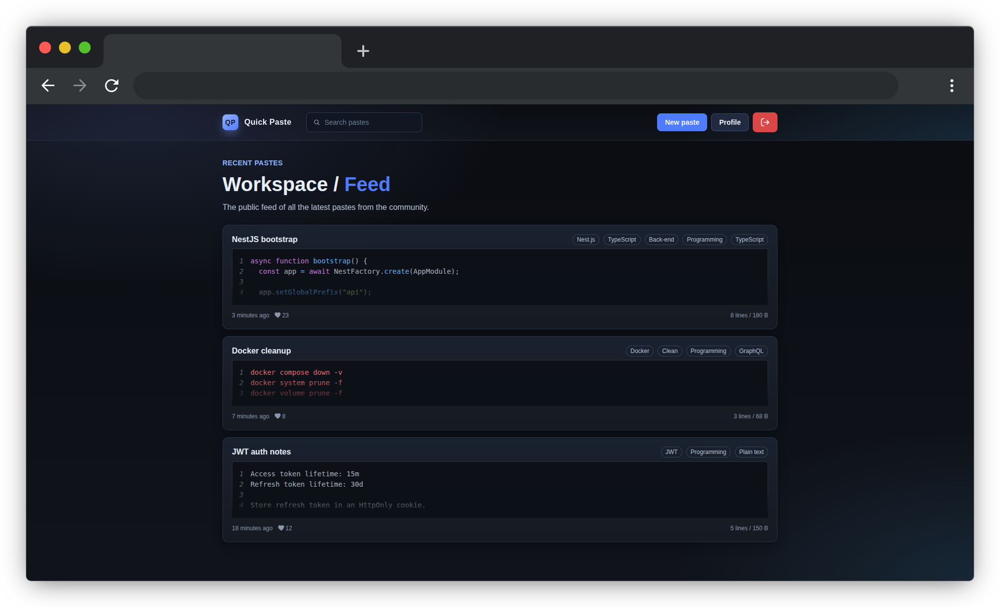

# QuickPaste

QuickPaste is a full-stack paste-sharing application for publishing and discussing code or plain text. It supports authenticated user accounts, multiple visibility modes, password-protected and expiring pastes, syntax highlighting, search, likes, comments, replies, and user profiles.

The application is usable and actively developed. Some planned features and broader test coverage are still in progress.



## Preview

A hosted demo is not available yet. The complete application can be previewed locally with the [production setup](#production):

```text
http://localhost:8080
```

The default port is controlled by `FRONTEND_PORT` in `.env.prod`.

Main user flows:

- Register or sign in with access and refresh token authentication.
- Create public, unlisted, private, or password-protected pastes.
- Configure syntax highlighting, tags, categories, expiration, or burn-after-read behavior.
- Search public pastes and browse paginated results.
- Like, edit, and delete owned pastes.
- Create, edit, delete, and reply to comments.
- View and update user profiles and activity statistics.

## Technology stack

| Area | Technologies |
| --- | --- |
| Client | React 19, TypeScript, Vite, React Router, TanStack Query, Redux Toolkit, React Hook Form, Zod, Sass |
| Server | NestJS 11, TypeScript, Prisma, PostgreSQL, Redis, Passport, JWT, Argon2 |
| Testing | Vitest, Testing Library, Playwright, Jest, Supertest |
| Delivery | Docker Compose, multi-stage Docker builds, Nginx |

## Installation

### Requirements

- Node.js 24
- npm 11 or later
- Docker with Docker Compose
- Git

Clone the repository:

```bash
git clone https://github.com/kkpanfilov/quick-paste.git
cd quick-paste
```

### Development

Development runs PostgreSQL and Redis in Docker while the client and server run locally with hot reload.

1. Create the development environment file and replace every placeholder value:

   ```bash
   cp .env.dev.example .env.dev
   ```

2. Start the infrastructure:

   ```bash
   docker compose \
     -p quick-paste-dev \
     -f docker-compose.dev.yml \
     --env-file .env.dev \
     up -d
   ```

3. Install and prepare the server:

   ```bash
   cd server
   npm ci
   npm run prisma:dev:generate
   npm run prisma:dev:migrate
   npm run start:dev
   ```

4. In another terminal, install and start the client:

   ```bash
   cd client
   npm ci
   npm run dev
   ```

Open `http://localhost:5173`. PgAdmin is available at `http://localhost:5051` with the default development credentials defined in `docker-compose.dev.yml`.

### Production

Production runs the client, server, PostgreSQL, and Redis in Docker. Nginx serves the client and proxies `/api` requests to the NestJS server.

1. Create the production environment file and set strong credentials:

   ```bash
   cp .env.prod.example .env.prod
   ```

2. Build and start the stack:

   ```bash
   docker compose \
     -p quick-paste-prod \
     -f docker-compose.prod.yml \
     --env-file .env.prod \
     up -d --build
   ```

3. Open `http://localhost:8080`, or use the port assigned to `FRONTEND_PORT`.

Database migrations run automatically when the production server starts. To inspect startup problems, run:

```bash
docker compose \
  -p quick-paste-prod \
  -f docker-compose.prod.yml \
  --env-file .env.prod \
  logs -f
```

### Test environment

The test environment uses isolated PostgreSQL and Redis instances in Docker.

```bash
cp .env.test.example .env.test

docker compose \
  -p quick-paste-test \
  -f docker-compose.test.yml \
  --env-file .env.test \
  up -d

cd server
npm ci
npm run prisma:test:generate
npm run prisma:test:deploy

cd ../client
npm ci
npx playwright install chromium
```

Replace all placeholders in `.env.test` before deploying the test database schema.

Keep the test server running in a separate terminal when executing the Playwright browser test:

```bash
cd server
npm run start:test
```

## Usage

After starting the application:

1. Register an account or sign in.
2. Select **New** and enter the paste title and content.
3. Optionally choose a language, expiration period, category, tags, visibility mode, and password.
4. Submit the form and share the generated paste URL according to its visibility rules.
5. Use the paste page to like, comment, reply, edit, or delete content when authorized.

Public pastes appear on the home page and in search results. Unlisted pastes are accessible through their direct URL. Private pastes are restricted to their author, while protected pastes require a password.

## Architecture

```text
Browser
  -> React client
     -> feature hooks and API client
     -> Redux for client-wide state
     -> TanStack Query for server state
  -> Nginx / Vite proxy
  -> NestJS REST API
     -> feature modules: auth, users, pastes, comments
     -> Prisma -> PostgreSQL
     -> Redis cache
```

The architecture has several practical strengths:

- **Clear client boundaries:** screens handle presentation, feature hooks coordinate API operations, and the shared API client centralizes authentication and error handling.
- **Separated state responsibilities:** TanStack Query manages remote data, while Redux is limited to authentication and notifications.
- **Feature-based server modules:** authentication, users, pastes, and comments have separate controllers, services, DTOs, and tests.
- **Validated data boundaries:** NestJS validation pipes and DTOs reject unknown or invalid request data before it reaches business logic.
- **Explicit persistence model:** Prisma defines relations, unique constraints, indexes, and cascade behavior for users, pastes, comments, likes, and tags.
- **Cache-aware reads:** Redis caches frequently requested paste lists, paste details, and public user information, with targeted invalidation after writes.
- **Safer authentication design:** passwords and stored refresh tokens use Argon2 hashes; access tokens stay in memory and refresh tokens use HTTP-only cookies.
- **Reproducible environments:** development, testing, and production have separate environment examples and Docker Compose configurations.

### Project structure

```text
quick-paste/
├── client/                 React application, UI tests, and browser tests
│   └── src/
│       ├── api/            HTTP client and authentication refresh logic
│       ├── components/     Screens, layout, and reusable UI components
│       ├── hooks/          Feature queries, mutations, and shared hooks
│       ├── routes/         Route definitions
│       ├── shared/         In-memory stores, maps, and shared libraries
│       └── store/          Redux state
├── server/                 NestJS REST API
│   ├── prisma/             Database schema and migrations
│   ├── src/                Feature modules and infrastructure services
│   └── test/               Integration and API end-to-end tests
├── docker-compose.dev.yml  Development infrastructure
├── docker-compose.test.yml Isolated test infrastructure
└── docker-compose.prod.yml Complete production stack
```

## Testing

### Client

```bash
cd client
npm run test:run   # unit and component tests
npm run test:e2e   # Playwright browser test; requires the test stack and server
npm run lint
npm run build
```

### Server

```bash
cd server
npm run test:unit
npm run test:integration  # requires the test database and Redis
npm run test:e2e          # requires the test database and Redis
npm run lint
npm run build
```

The current suite covers client utilities and selected components, server validation and authentication logic, authentication integration and API flows, and one complete browser flow from registration to paste creation. Coverage is meaningful but not yet broad across all paste, comment, and user behavior.

## TODO

The working backlog is maintained in `TODO.md`. Current priorities are:

- Migrate the repository to npm workspaces.
- Set up GitHub Actions
- Evaluate a migration to Next.js.
- Expand test coverage across the application.
- Complete user role behavior.
- Support comments nested beyond one reply level.
- Complete shared-paste visibility.
- Publish a hosted demo.

## Project status

QuickPaste is a functional portfolio project under active development. Core paste sharing, authentication, profiles, engagement features, persistence, caching, and containerized delivery are implemented. The public demo, wider end-to-end coverage, role-based behavior, shared visibility, and deeper comment trees remain unfinished.
